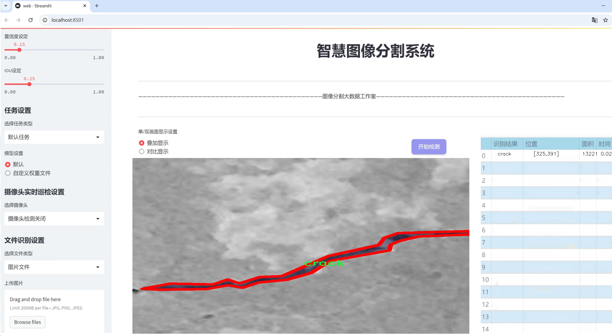
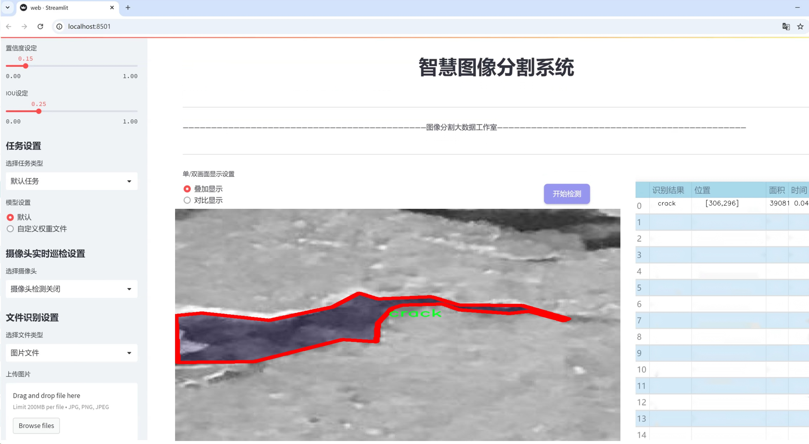
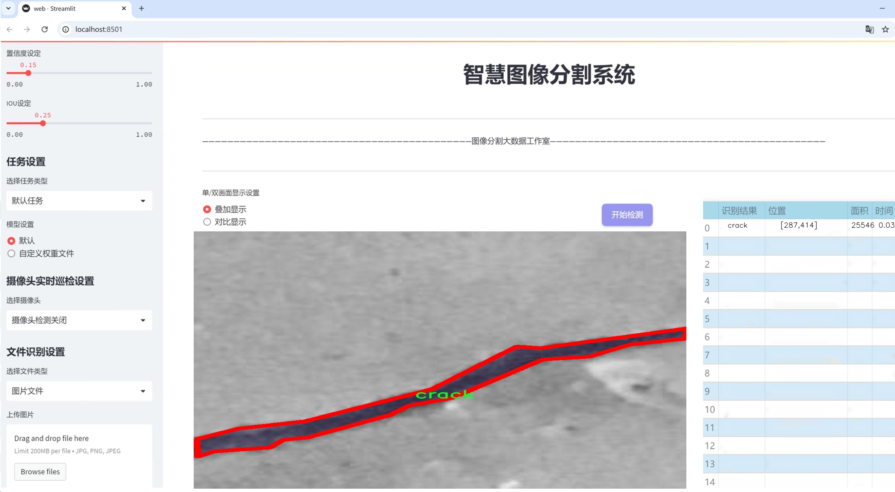
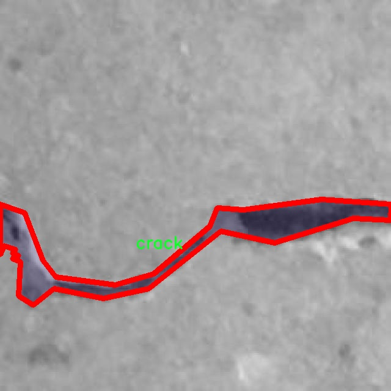
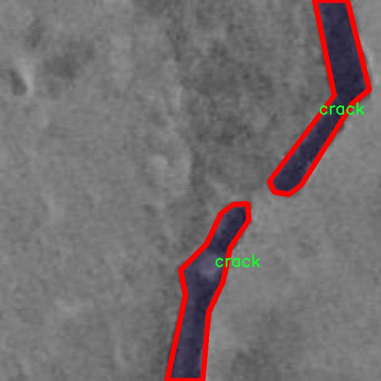
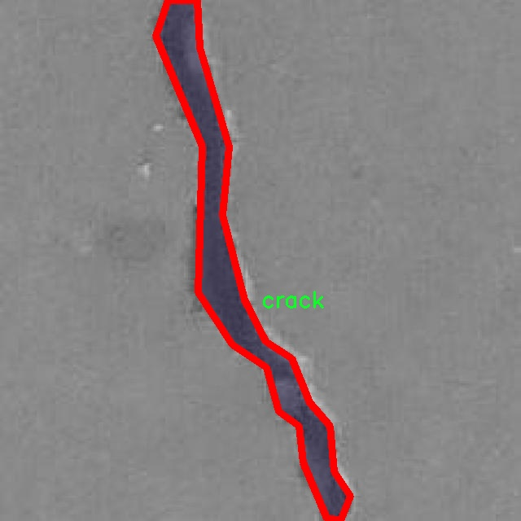
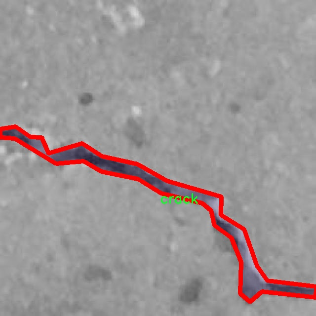
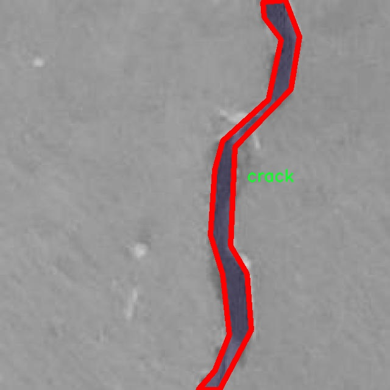

# 裂缝检测分割系统源码＆数据集分享
 [yolov8-seg-KernelWarehouse＆yolov8-seg-timm等50+全套改进创新点发刊_一键训练教程_Web前端展示]

### 1.研究背景与意义

项目参考[ILSVRC ImageNet Large Scale Visual Recognition Challenge](https://gitee.com/YOLOv8_YOLOv11_Segmentation_Studio/projects)

项目来源[AAAI Global Al lnnovation Contest](https://kdocs.cn/l/cszuIiCKVNis)

研究背景与意义

随着城市化进程的加快，基础设施的建设与维护变得愈发重要，尤其是混凝土结构的安全性与耐久性。裂缝作为混凝土结构常见的病害之一，直接影响到结构的使用寿命和安全性。因此，及时、准确地检测和评估裂缝的情况，对于保障建筑物的安全和延长其使用寿命具有重要意义。传统的裂缝检测方法主要依赖人工目测和简单的图像处理技术，这不仅效率低下，而且容易受到人为因素的影响，导致检测结果的不准确。因此，基于计算机视觉和深度学习的自动化裂缝检测技术逐渐成为研究的热点。

YOLO（You Only Look Once）系列模型因其高效的实时目标检测能力而受到广泛关注。特别是YOLOv8作为该系列的最新版本，凭借其在精度和速度上的优越表现，成为裂缝检测领域的理想选择。通过对YOLOv8模型的改进，可以更好地适应裂缝检测的需求，提升模型在复杂环境下的鲁棒性和准确性。裂缝的形态、大小和分布具有多样性，改进后的YOLOv8能够通过实例分割技术，精确地识别和分割不同类型的裂缝，从而为后续的结构健康监测提供可靠的数据支持。

本研究使用的数据集“Crack detection prova 3”包含2100幅图像，涵盖了四类裂缝，包括“Crack”、“Cracks”、“crack”和“type of crack 2”。这些数据的多样性为模型的训练和验证提供了丰富的样本，有助于提高模型的泛化能力。通过对这些图像进行标注和分类，研究者能够深入分析不同类型裂缝的特征，从而为裂缝的检测与评估提供更为精准的依据。此外，数据集中裂缝的多样性也为模型的改进提供了挑战，促使研究者不断探索更为先进的算法和技术。

本研究的意义不仅在于提升裂缝检测的准确性和效率，更在于推动智能建筑监测技术的发展。通过建立基于改进YOLOv8的裂缝检测分割系统，可以实现对建筑物的实时监测，及时发现潜在的安全隐患，降低事故发生的风险。同时，该系统的推广应用也将为相关领域的研究提供新的思路和方法，促进人工智能技术在工程领域的深入应用。

综上所述，基于改进YOLOv8的裂缝检测分割系统的研究，不仅具有重要的理论价值，还有着广泛的实际应用前景。通过对裂缝检测技术的深入探索与创新，能够为建筑行业的安全管理提供有力的技术支持，推动智能监测技术的进步，最终实现更高水平的基础设施安全保障。

### 2.图片演示







##### 注意：由于此博客编辑较早，上面“2.图片演示”和“3.视频演示”展示的系统图片或者视频可能为老版本，新版本在老版本的基础上升级如下：（实际效果以升级的新版本为准）

  （1）适配了YOLOV8的“目标检测”模型和“实例分割”模型，通过加载相应的权重（.pt）文件即可自适应加载模型。

  （2）支持“图片识别”、“视频识别”、“摄像头实时识别”三种识别模式。

  （3）支持“图片识别”、“视频识别”、“摄像头实时识别”三种识别结果保存导出，解决手动导出（容易卡顿出现爆内存）存在的问题，识别完自动保存结果并导出到tempDir中。

  （4）支持Web前端系统中的标题、背景图等自定义修改，后面提供修改教程。

  另外本项目提供训练的数据集和训练教程,暂不提供权重文件（best.pt）,需要您按照教程进行训练后实现图片演示和Web前端界面演示的效果。

### 3.视频演示

[3.1 视频演示](https://www.bilibili.com/video/BV1gF1zYjERZ/)

### 4.数据集信息展示

##### 4.1 本项目数据集详细数据（类别数＆类别名）

nc: 4
names: ['Crack', 'Cracks', 'crack', 'type of crack 2']


##### 4.2 本项目数据集信息介绍

数据集信息展示

在现代计算机视觉领域，裂缝检测的准确性和效率至关重要，尤其是在基础设施维护和安全监测中。为此，本研究选用了名为“Crack detection prova 3”的数据集，旨在训练和改进YOLOv8-seg模型，以实现更高效的裂缝检测和分割。该数据集专门针对裂缝检测任务而设计，包含了丰富的样本和多样的裂缝类型，为模型的训练提供了坚实的基础。

“Crack detection prova 3”数据集共包含四个类别，具体为“Crack”、“Cracks”、“crack”和“type of crack 2”。这些类别的设置不仅反映了裂缝的不同表现形式，还考虑到了实际应用中可能遇到的各种情况。通过将裂缝细分为不同的类别，模型能够更好地理解和识别各种裂缝特征，从而提高检测的准确性和可靠性。

在数据集的构建过程中，研究者们精心挑选了多种类型的裂缝图像，这些图像来源于不同的环境和材料，包括混凝土、沥青等。每一类裂缝都经过标注，确保了数据的高质量和高准确性。这种多样性不仅有助于模型学习到不同裂缝的特征，还能够增强模型在实际应用中的泛化能力，使其能够适应不同的检测场景。

此外，数据集中的图像涵盖了不同的光照条件、角度和背景，这些因素都可能影响裂缝的可见性和识别难度。通过引入这些变化，数据集能够有效地模拟现实世界中的复杂情况，从而提高模型在实际应用中的表现。这种设计理念确保了模型在训练过程中能够接触到丰富的样本，从而提升其对新样本的适应能力。

在使用“Crack detection prova 3”数据集进行YOLOv8-seg模型的训练时，研究者们将采用数据增强技术，以进一步提高模型的鲁棒性。数据增强可以通过旋转、缩放、翻转等方式生成新的训练样本，帮助模型在面对未见过的裂缝类型时，依然能够保持较高的检测准确率。这种方法不仅能够扩展数据集的有效性，还能在一定程度上缓解过拟合问题，使模型在训练和测试阶段都能表现出色。

综上所述，“Crack detection prova 3”数据集为裂缝检测任务提供了一个高质量的基础，涵盖了多种裂缝类型和复杂的环境条件，确保了模型训练的全面性和有效性。通过对该数据集的深入研究和应用，期望能够推动裂缝检测技术的发展，提高基础设施的安全性和维护效率，为相关领域的研究和实践提供重要的支持。











### 5.全套项目环境部署视频教程（零基础手把手教学）

[5.1 环境部署教程链接（零基础手把手教学）](https://www.bilibili.com/video/BV1jG4Ve4E9t/?vd_source=bc9aec86d164b67a7004b996143742dc)


[5.2 安装Python虚拟环境创建和依赖库安装视频教程链接（零基础手把手教学）](https://www.bilibili.com/video/BV1nA4VeYEze/?vd_source=bc9aec86d164b67a7004b996143742dc)

### 6.手把手YOLOV8-seg训练视频教程（零基础小白有手就能学会）

[6.1 手把手YOLOV8-seg训练视频教程（零基础小白有手就能学会）](https://www.bilibili.com/video/BV1cA4VeYETe/?vd_source=bc9aec86d164b67a7004b996143742dc)


按照上面的训练视频教程链接加载项目提供的数据集，运行train.py即可开始训练



     Epoch   gpu_mem       box       obj       cls    labels  img_size
     1/200     0G   0.01576   0.01955  0.007536        22      1280: 100%|██████████| 849/849 [14:42<00:00,  1.04s/it]
               Class     Images     Labels          P          R     mAP@.5 mAP@.5:.95: 100%|██████████| 213/213 [01:14<00:00,  2.87it/s]
                 all       3395      17314      0.994      0.957      0.0957      0.0843

     Epoch   gpu_mem       box       obj       cls    labels  img_size
     2/200     0G   0.01578   0.01923  0.007006        22      1280: 100%|██████████| 849/849 [14:44<00:00,  1.04s/it]
               Class     Images     Labels          P          R     mAP@.5 mAP@.5:.95: 100%|██████████| 213/213 [01:12<00:00,  2.95it/s]
                 all       3395      17314      0.996      0.956      0.0957      0.0845

     Epoch   gpu_mem       box       obj       cls    labels  img_size
     3/200     0G   0.01561    0.0191  0.006895        27      1280: 100%|██████████| 849/849 [10:56<00:00,  1.29it/s]
               Class     Images     Labels          P          R     mAP@.5 mAP@.5:.95: 100%|███████   | 187/213 [00:52<00:00,  4.04it/s]
                 all       3395      17314      0.996      0.957      0.0957      0.0845


### 7.50+种全套YOLOV8-seg创新点代码加载调参视频教程（一键加载写好的改进模型的配置文件）

[7.1 50+种全套YOLOV8-seg创新点代码加载调参视频教程（一键加载写好的改进模型的配置文件）](https://www.bilibili.com/video/BV1Hw4VePEXv/?vd_source=bc9aec86d164b67a7004b996143742dc)

### 8.YOLOV8-seg图像分割算法原理

原始YOLOv8-seg算法原理

YOLOv8-seg算法是Ultralytics在2023年1月发布的一款前沿目标检测与分割模型，它在YOLO系列算法的基础上进行了深度优化和创新，结合了多种先进的计算机视觉技术，旨在提升目标检测的精度和速度。该算法的核心在于其独特的网络结构和高效的训练策略，使得其在实时目标检测领域达到了新的高度。

YOLOv8-seg的网络结构可以分为三个主要部分：Backbone、Neck和Head。每个部分在整体架构中扮演着至关重要的角色，协同工作以实现高效的目标检测和分割。

首先，Backbone部分负责特征提取。YOLOv8-seg采用了一系列卷积层和反卷积层，通过残差连接和瓶颈结构来减小网络的大小并提高性能。具体而言，Backbone由5个CBS模块、4个C2f模块和1个快速空间金字塔池化（SPPF）模块组成。CBS模块的设计使得网络能够在不同层次上提取丰富的特征，而C2f模块则通过融合不同尺度的信息，增强了模型对小目标的检测能力。SPPF模块的引入进一步提升了特征图的表达能力，使得模型在处理复杂场景时更加高效。

接下来是Neck部分，它的主要功能是进行多尺度特征融合。YOLOv8-seg通过将来自Backbone不同阶段的特征图进行融合，能够更好地捕捉不同尺度目标的信息。这种多尺度特征融合技术显著提高了目标检测的性能和鲁棒性，使得模型在面对各种尺寸和形状的目标时，依然能够保持高效的检测能力。Neck部分的设计理念在于充分利用网络中各层次的特征信息，从而实现更为精准的目标定位和分类。

最后，Head部分负责最终的目标检测和分类任务。YOLOv8-seg设有三个检测头，分别用于在不同尺寸信息下检测目标。这些检测头通过一系列卷积层和反卷积层，生成最终的检测结果。通过这种设计，YOLOv8-seg能够在保持高精度的同时，显著提高检测速度。此外，YOLOv8-seg在Head部分的标签分配和损失计算方面也借鉴了PP-YOLOE的设计，进一步优化了训练过程，提高了模型的收敛速度和稳定性。

YOLOv8-seg的训练过程采用了先进的多尺度训练和测试策略，这使得模型在面对不同分辨率的输入时，依然能够保持优异的性能。通过在训练过程中引入数据增强技术，YOLOv8-seg能够有效提高模型的泛化能力，使其在实际应用中表现得更加稳健。

在应用层面，YOLOv8-seg不仅适用于传统的目标检测任务，还可以扩展到图像分割等更复杂的计算机视觉任务。例如，在农业领域，YOLOv8-seg可以被用于苹果的自动检测与定位，为自动采摘机器人提供实时的视觉信息。这种应用场景的实现，不仅依赖于YOLOv8-seg的高效特征提取和多尺度融合能力，还需要结合其他算法，如蚁群算法进行路径规划，以确保机器人能够快速、准确地完成采摘任务。

综上所述，YOLOv8-seg算法的原理在于其创新的网络结构和高效的训练策略。通过Backbone、Neck和Head的紧密协作，YOLOv8-seg实现了在目标检测和分割任务中的高精度和高速度。随着YOLOv8-seg的不断发展和应用，其在各个领域的潜力将被进一步挖掘，为计算机视觉技术的进步提供强有力的支持。


### 9.系统功能展示（检测对象为举例，实际内容以本项目数据集为准）

图9.1.系统支持检测结果表格显示

  图9.2.系统支持置信度和IOU阈值手动调节

  图9.3.系统支持自定义加载权重文件best.pt(需要你通过步骤5中训练获得)

  图9.4.系统支持摄像头实时识别

  图9.5.系统支持图片识别

  图9.6.系统支持视频识别

  图9.7.系统支持识别结果文件自动保存

  图9.8.系统支持Excel导出检测结果数据


### 10.50+种全套YOLOV8-seg创新点原理讲解（非科班也可以轻松写刊发刊，V11版本正在科研待更新）

#### 10.1 由于篇幅限制，每个创新点的具体原理讲解就不一一展开，具体见下列网址中的创新点对应子项目的技术原理博客网址【Blog】：


[10.1 50+种全套YOLOV8-seg创新点原理讲解链接](https://gitee.com/qunmasj/good)

#### 10.2 部分改进模块原理讲解(完整的改进原理见上图和技术博客链接)

### YOLOv8简介
YoloV8模型结构
YOLOv3之前的所有YOLO对象检测模型都是用C语言编写的，并使用了Darknet框架，Ultralytics发布了第一个使用PyTorch框架实现的YOLO (YOLOv3)；YOLOv3之后，Ultralytics发布了YOLOv5，在2023年1月，Ultralytics发布了YOLOv8，包含五个模型，用于检测、分割和分类。 YOLOv8 Nano是其中最快和最小的，而YOLOv8 Extra Large (YOLOv8x)是其中最准确但最慢的，具体模型见后续的图。

YOLOv8附带以下预训练模型:

目标检测在图像分辨率为640的COCO检测数据集上进行训练。
实例分割在图像分辨率为640的COCO分割数据集上训练。
图像分类模型在ImageNet数据集上预训练，图像分辨率为224。
YOLOv8 概述
具体到 YOLOv8 算法，其核心特性和改动可以归结为如下：

提供了一个全新的SOTA模型（state-of-the-art model），包括 P5 640 和 P6 1280 分辨率的目标检测网络和基于YOLACT的实例分割模型。和 YOLOv5 一样，基于缩放系数也提供了 N/S/M/L/X 尺度的不同大小模型，用于满足不同场景需求
骨干网络和 Neck 部分可能参考了 YOLOv7 ELAN 设计思想，将 YOLOv5 的 C3 结构换成了梯度流更丰富的 C2f 结构，并对不同尺度模型调整了不同的通道数，属于对模型结构精心微调，不再是一套参数应用所有模型，大幅提升了模型性能。
Head 部分相比 YOLOv5 改动较大，换成了目前主流的解耦头结构，将分类和检测头分离，同时也从Anchor-Based 换成了 Anchor-Free
Loss 计算方面采用了TaskAlignedAssigner正样本分配策略，并引入了Distribution Focal Loss
训练的数据增强部分引入了 YOLOX 中的最后 10 epoch 关闭 Mosiac 增强的操作，可以有效地提升精度


### HRNet V2简介
现在设计高低分辨率融合的思路主要有以下四种：


（a）对称结构。如U-Net、Hourglass等，都是先下采样再上采样，上下采样过程对称。

（b）级联金字塔。如refinenet等，高低分辨率融合时经过卷积处理。

（c）简单的baseline，用转职卷积进行上采样。

（d）扩张卷积。如deeplab等，增大感受野，减少下采样次数，可以无需跳层连接直接进行上采样。

（b）（c）都是使用复杂一些的网络进行下采样（如resnet、vgg），再用轻量级的网络进行上采样。

HRNet V1是在（b）的基础上进行改进，从头到尾保持大的分辨率表示。然而HRNet V1仅是用在姿态估计领域的，HRNet V2对它做小小的改进可以使其适用于更广的视觉任务。这一改进仅仅增加了较小的计算开销，但却提升了较大的准确度。

#### 网络结构图：


这个结构图简洁明了就不多介绍了，首先图2的输入是已经经过下采样四倍的feature map，横向的conv block指的是basicblock 或 bottleblock，不同分辨率之间的多交叉线部分是multi-resolution convolution（多分辨率组卷积）。

到此为止HRNet V2和HRNet V1是完全一致的。

区别之处在于这个基网络上加的一个head：


图3介绍的是接在图2最后的head。（a）是HRNet V1的头，很明显他只用了大分辨率的特征图。（b）（c）是HRNet V2的创新点，（b）用与语义分割，（c）用于目标检测。除此之外作者还在实验部分介绍了用于分类的head，如图4所示。


#### 多分辨率block：


一个多分辨率block由多分辨率组卷积（a）和多分辨率卷积（b）组成。（c）是一个正常卷积的展开，（b）的灵感来源于（c）。代码中（a）部分由Bottleneck和BasicBlock组成。

多分辨率卷积和正常卷积的区别：（1）多分辨率卷积中，每个通道的subset的分辨率都不一样。（2）通道之间的连接如果是降分辨率，则用的是3x3的2stride的卷积，如果是升分辨率，用的是双线性最邻近插值上采样。


### 11.项目核心源码讲解（再也不用担心看不懂代码逻辑）

#### 11.1 ui.py

以下是代码的核心部分，并附上详细的中文注释：

```python
import sys
import subprocess

def run_script(script_path):
    """
    使用当前 Python 环境运行指定的脚本。

    Args:
        script_path (str): 要运行的脚本路径

    Returns:
        None
    """
    # 获取当前 Python 解释器的路径
    python_path = sys.executable

    # 构建运行命令，使用 streamlit 运行指定的脚本
    command = f'"{python_path}" -m streamlit run "{script_path}"'

    # 执行命令
    result = subprocess.run(command, shell=True)
    # 检查命令执行的返回码，如果不为0，表示执行出错
    if result.returncode != 0:
        print("脚本运行出错。")

# 实例化并运行应用
if __name__ == "__main__":
    # 指定要运行的脚本路径
    script_path = "web.py"  # 假设脚本在当前目录下

    # 调用函数运行脚本
    run_script(script_path)
```

### 代码分析：
1. **导入模块**：
   - `sys`：用于获取当前 Python 解释器的路径。
   - `subprocess`：用于执行外部命令。

2. **`run_script` 函数**：
   - 接受一个参数 `script_path`，表示要运行的 Python 脚本的路径。
   - 使用 `sys.executable` 获取当前 Python 解释器的路径。
   - 构建命令字符串，使用 `streamlit` 模块运行指定的脚本。
   - 使用 `subprocess.run` 执行命令，并检查返回码以确定脚本是否成功运行。

3. **主程序入口**：
   - 在 `if __name__ == "__main__":` 块中，指定要运行的脚本路径（这里假设为 `web.py`）。
   - 调用 `run_script` 函数来执行该脚本。

### 重点：
- 该代码的核心功能是通过当前 Python 环境运行指定的 Streamlit 脚本，并能够检测脚本执行是否成功。

这个文件名为 `ui.py`，它的主要功能是通过当前的 Python 环境来运行一个指定的脚本。代码中首先导入了必要的模块，包括 `sys`、`os` 和 `subprocess`，以及一个自定义的 `abs_path` 函数，这个函数可能用于获取文件的绝对路径。

在 `run_script` 函数中，接受一个参数 `script_path`，它是要运行的脚本的路径。函数首先获取当前 Python 解释器的路径，使用 `sys.executable`。接着，构建一个命令字符串，这个命令会调用 `streamlit` 模块来运行指定的脚本。具体的命令格式是 `"{python_path}" -m streamlit run "{script_path}"`，其中 `python_path` 是当前 Python 解释器的路径，`script_path` 是传入的脚本路径。

随后，使用 `subprocess.run` 方法来执行这个命令。`shell=True` 参数表示命令将在一个新的 shell 中执行。执行后，函数会检查返回的结果，如果返回码不为 0，表示脚本运行出错，程序会打印出相应的错误信息。

在文件的最后部分，使用 `if __name__ == "__main__":` 语句来确保只有在直接运行该文件时才会执行下面的代码。这里指定了要运行的脚本路径为 `web.py`，并调用 `run_script` 函数来执行这个脚本。

总体来说，这个程序的功能是提供一个简单的接口来运行一个名为 `web.py` 的脚本，利用 `streamlit` 框架来启动一个 Web 应用。

#### 11.2 ultralytics\models\fastsam\val.py

```python
# 导入必要的模块
from ultralytics.models.yolo.segment import SegmentationValidator
from ultralytics.utils.metrics import SegmentMetrics

class FastSAMValidator(SegmentationValidator):
    """
    自定义验证类，用于在Ultralytics YOLO框架中进行快速SAM（Segment Anything Model）分割。

    该类扩展了SegmentationValidator类，专门定制了快速SAM的验证过程。它将任务设置为'分割'，并使用SegmentMetrics进行评估。此外，为了避免在验证过程中出现错误，禁用了绘图功能。
    """

    def __init__(self, dataloader=None, save_dir=None, pbar=None, args=None, _callbacks=None):
        """
        初始化FastSAMValidator类，将任务设置为'分割'，并将指标设置为SegmentMetrics。

        参数：
            dataloader (torch.utils.data.DataLoader): 用于验证的数据加载器。
            save_dir (Path, optional): 保存结果的目录。
            pbar (tqdm.tqdm): 用于显示进度的进度条。
            args (SimpleNamespace): 验证器的配置。
            _callbacks (dict): 用于存储各种回调函数的字典。

        注意：
            为了避免错误，在此类中禁用了ConfusionMatrix和其他相关指标的绘图。
        """
        # 调用父类的初始化方法
        super().__init__(dataloader, save_dir, pbar, args, _callbacks)
        # 设置任务类型为'分割'
        self.args.task = 'segment'
        # 禁用绘图功能以避免错误
        self.args.plots = False  
        # 初始化分割指标
        self.metrics = SegmentMetrics(save_dir=self.save_dir, on_plot=self.on_plot)
```

### 代码核心部分解释：
1. **类定义**：`FastSAMValidator` 继承自 `SegmentationValidator`，用于快速SAM分割的自定义验证。
2. **初始化方法**：在构造函数中，设置任务类型为'分割'，并禁用绘图功能以避免错误，同时初始化分割指标。
3. **参数说明**：详细描述了构造函数的参数，包括数据加载器、保存目录、进度条、配置和回调函数等。

这个程序文件定义了一个名为 `FastSAMValidator` 的类，该类用于在 Ultralytics YOLO 框架中进行快速 SAM（Segment Anything Model）分割的自定义验证。它继承自 `SegmentationValidator` 类，并针对快速 SAM 定制了验证过程。

在类的文档字符串中，说明了该类的主要功能和属性。`FastSAMValidator` 的主要任务是进行分割，因此在初始化时将任务设置为 'segment'，并使用 `SegmentMetrics` 进行评估。此外，为了避免在验证过程中出现错误，该类禁用了绘图功能。

在 `__init__` 方法中，构造函数接受多个参数，包括数据加载器 `dataloader`、保存结果的目录 `save_dir`、进度条 `pbar`、额外的配置参数 `args` 以及用于存储回调函数的字典 `_callbacks`。通过调用父类的构造函数，初始化这些属性后，设置任务为 'segment'，并将绘图功能禁用，以避免与混淆矩阵和其他相关指标的绘图相关的错误。最后，实例化 `SegmentMetrics`，用于在指定的保存目录中进行评估。

总的来说，这个文件的目的是为快速 SAM 分割模型提供一个专门的验证工具，确保在验证过程中能够有效地评估模型性能，同时避免不必要的错误。

#### 11.3 ultralytics\models\sam\__init__.py

以下是保留的核心代码部分，并添加了详细的中文注释：

```python
# 导入所需的模块
from .model import SAM  # 从当前包的model模块中导入SAM类
from .predict import Predictor  # 从当前包的predict模块中导入Predictor类

# 定义模块的公开接口
__all__ = 'SAM', 'Predictor'  # 通过元组或列表指定模块的公开接口，允许外部访问SAM和Predictor
```

### 代码注释说明：
1. **导入模块**：
   - `from .model import SAM`：从当前包的`model`模块中导入`SAM`类，`SAM`可能是一个模型类，用于实现某种算法或功能。
   - `from .predict import Predictor`：从当前包的`predict`模块中导入`Predictor`类，`Predictor`可能是一个用于进行预测的类。

2. **定义公开接口**：
   - `__all__`：这是一个特殊变量，用于定义模块的公开接口。当使用`from module import *`时，只有在`__all__`中列出的名称会被导入。这里指定了`SAM`和`Predictor`为模块的公开部分，表示这两个类是用户可以直接使用的接口。

这个程序文件是一个Python模块的初始化文件，文件名为`__init__.py`，位于`ultralytics/models/sam/`目录下。该文件的主要作用是定义模块的公共接口，并引入模块中的重要类或函数。

首先，文件开头的注释`# Ultralytics YOLO 🚀, AGPL-3.0 license`表明这个项目是与Ultralytics YOLO相关的，并且使用的是AGPL-3.0许可证。这意味着该代码是开源的，用户可以自由使用和修改，但需要遵循相关的许可证条款。

接下来，文件通过`from .model import SAM`和`from .predict import Predictor`这两行代码从同一目录下的`model.py`和`predict.py`文件中导入了`SAM`类和`Predictor`类。这意味着在使用这个模块时，可以直接访问这两个类，而不需要单独导入它们所在的文件。

最后，`__all__ = 'SAM', 'Predictor'`这一行定义了模块的公共接口，表明当使用`from ultralytics.models.sam import *`这种方式导入模块时，只会导入`SAM`和`Predictor`这两个名称。这是一种控制模块导出内容的方式，有助于避免名称冲突并提高代码的可读性。

总的来说，这个`__init__.py`文件的作用是简化模块的使用，使得用户能够方便地访问`SAM`和`Predictor`这两个重要的类，同时也遵循了开源协议的规定。

#### 11.4 train.py

以下是经过简化和注释的核心代码部分：

```python
import os
import torch
import yaml
from ultralytics import YOLO  # 导入YOLO模型库

if __name__ == '__main__':  # 确保该模块被直接运行时才执行以下代码
    # 设置训练参数
    workers = 1  # 数据加载的工作进程数
    batch = 8  # 每个批次的样本数量
    device = "0" if torch.cuda.is_available() else "cpu"  # 检查是否有可用的GPU

    # 获取数据集配置文件的绝对路径
    data_path = abs_path(f'datasets/data/data.yaml', path_type='current')

    # 读取YAML文件，保持原有顺序
    with open(data_path, 'r') as file:
        data = yaml.load(file, Loader=yaml.FullLoader)

    # 修改数据集中训练、验证和测试的路径
    if 'train' in data and 'val' in data and 'test' in data:
        directory_path = os.path.dirname(data_path.replace(os.sep, '/'))  # 获取目录路径
        data['train'] = directory_path + '/train'  # 更新训练数据路径
        data['val'] = directory_path + '/val'      # 更新验证数据路径
        data['test'] = directory_path + '/test'    # 更新测试数据路径

        # 将修改后的数据写回YAML文件
        with open(data_path, 'w') as file:
            yaml.safe_dump(data, file, sort_keys=False)

    # 加载YOLO模型配置和预训练权重
    model = YOLO(r"C:\codeseg\codenew\50+种YOLOv8算法改进源码大全和调试加载训练教程（非必要）\改进YOLOv8模型配置文件\yolov8-seg-C2f-Faster.yaml").load("./weights/yolov8s-seg.pt")

    # 开始训练模型
    results = model.train(
        data=data_path,  # 指定训练数据的配置文件路径
        device=device,    # 指定使用的设备（GPU或CPU）
        workers=workers,  # 数据加载的工作进程数
        imgsz=640,        # 输入图像的大小
        epochs=100,       # 训练的轮数
        batch=batch,      # 每个批次的样本数量
    )
```

### 代码注释说明：
1. **导入必要的库**：引入了处理文件路径、深度学习框架（PyTorch）、YAML文件解析以及YOLO模型的库。
2. **主程序入口**：使用`if __name__ == '__main__':`确保只有在直接运行该脚本时才执行后续代码。
3. **设置训练参数**：定义了数据加载的工作进程数、批次大小和设备（GPU或CPU）。
4. **读取和修改YAML配置文件**：加载数据集的配置文件，更新训练、验证和测试数据的路径，并将修改后的内容写回文件。
5. **加载YOLO模型**：根据指定的配置文件和预训练权重加载YOLO模型。
6. **开始训练模型**：调用模型的训练方法，传入数据路径、设备、工作进程数、图像大小、训练轮数和批次大小等参数。

这个程序文件 `train.py` 是一个用于训练 YOLO（You Only Look Once）模型的脚本，主要用于目标检测或分割任务。程序首先导入了必要的库，包括 `os`、`torch`、`yaml` 和 `ultralytics` 中的 YOLO 模型。此外，还使用了 `matplotlib` 来设置图形后端。

在 `__main__` 代码块中，程序首先定义了一些训练参数，包括工作进程数 `workers` 和批次大小 `batch`。批次大小的设置需要根据计算机的显存和内存进行调整，如果出现显存不足的情况，可以适当降低这个值。接着，程序通过 `torch.cuda.is_available()` 检查是否有可用的 GPU，如果有则将设备设置为 "0"（表示第一个 GPU），否则使用 CPU。

程序接下来获取数据集配置文件的绝对路径，该文件是一个 YAML 格式的文件，包含了训练、验证和测试数据的路径。通过 `abs_path` 函数，程序将相对路径转换为绝对路径，并将路径中的分隔符统一为 Unix 风格的斜杠 `/`。然后，程序读取 YAML 文件的内容，并检查其中是否包含 `train`、`val` 和 `test` 项。如果这些项存在，程序将它们的路径修改为相对于数据集目录的路径，并将修改后的内容写回到 YAML 文件中。

接下来，程序加载 YOLO 模型的配置文件和预训练权重。这里使用的是 `yolov8-seg-C2f-Faster.yaml` 配置文件和相应的权重文件 `yolov8s-seg.pt`。用户可以根据需要选择不同的模型配置文件。

最后，程序调用 `model.train()` 方法开始训练模型。在训练过程中，指定了训练数据的配置文件路径、设备、工作进程数、输入图像的大小（640x640）、训练的轮数（100个 epoch）以及每个批次的大小（8）。训练完成后，模型将会根据提供的数据进行学习和优化，以提高其在目标检测或分割任务中的性能。

#### 11.5 ultralytics\utils\callbacks\neptune.py

以下是经过简化和注释的核心代码部分：

```python
# 导入必要的库
from ultralytics.utils import LOGGER, SETTINGS, TESTS_RUNNING

# 尝试导入 NeptuneAI 库并进行基本的设置检查
try:
    assert not TESTS_RUNNING  # 确保不是在测试环境中
    assert SETTINGS['neptune'] is True  # 确保启用了 Neptune 集成
    import neptune
    from neptune.types import File

    assert hasattr(neptune, '__version__')  # 检查 Neptune 版本

    run = None  # 初始化 NeptuneAI 实验记录实例

except (ImportError, AssertionError):
    neptune = None  # 如果导入失败或断言失败，则将 neptune 设置为 None


def _log_scalars(scalars, step=0):
    """将标量数据记录到 NeptuneAI 实验记录器中。"""
    if run:  # 如果 run 实例存在
        for k, v in scalars.items():  # 遍历标量字典
            run[k].append(value=v, step=step)  # 记录每个标量


def _log_images(imgs_dict, group=''):
    """将图像记录到 NeptuneAI 实验记录器中。"""
    if run:  # 如果 run 实例存在
        for k, v in imgs_dict.items():  # 遍历图像字典
            run[f'{group}/{k}'].upload(File(v))  # 上传每个图像


def on_pretrain_routine_start(trainer):
    """在训练例程开始之前调用的回调函数。"""
    try:
        global run
        # 初始化 Neptune 运行
        run = neptune.init_run(project=trainer.args.project or 'YOLOv8', name=trainer.args.name, tags=['YOLOv8'])
        # 记录超参数配置
        run['Configuration/Hyperparameters'] = {k: '' if v is None else v for k, v in vars(trainer.args).items()}
    except Exception as e:
        LOGGER.warning(f'WARNING ⚠️ NeptuneAI 安装但未正确初始化，未记录此运行。 {e}')


def on_train_epoch_end(trainer):
    """每个训练周期结束时调用的回调函数。"""
    _log_scalars(trainer.label_loss_items(trainer.tloss, prefix='train'), trainer.epoch + 1)  # 记录训练损失
    _log_scalars(trainer.lr, trainer.epoch + 1)  # 记录学习率
    if trainer.epoch == 1:  # 如果是第一个周期
        # 记录训练过程中的图像
        _log_images({f.stem: str(f) for f in trainer.save_dir.glob('train_batch*.jpg')}, 'Mosaic')


def on_train_end(trainer):
    """训练结束时调用的回调函数。"""
    if run:  # 如果 run 实例存在
        # 记录最终结果和模型
        files = [
            'results.png', 'confusion_matrix.png', 'confusion_matrix_normalized.png',
            *(f'{x}_curve.png' for x in ('F1', 'PR', 'P', 'R'))]
        files = [(trainer.save_dir / f) for f in files if (trainer.save_dir / f).exists()]  # 过滤存在的文件
        for f in files:
            _log_plot(title=f.stem, plot_path=f)  # 记录每个图像
        # 记录最佳模型
        run[f'weights/{trainer.args.name or trainer.args.task}/{str(trainer.best.name)}'].upload(File(str(trainer.best)))


# 定义回调函数字典
callbacks = {
    'on_pretrain_routine_start': on_pretrain_routine_start,
    'on_train_epoch_end': on_train_epoch_end,
    'on_train_end': on_train_end} if neptune else {}
```

### 代码注释说明：
1. **导入部分**：导入了必要的库和模块，确保在运行过程中能够使用到 NeptuneAI 进行实验记录。
2. **异常处理**：在尝试导入 NeptuneAI 时，进行了一系列的检查，确保在合适的环境中运行，并且记录器实例能够正常初始化。
3. **记录函数**：定义了 `_log_scalars` 和 `_log_images` 函数，用于将标量数据和图像上传到 NeptuneAI。
4. **回调函数**：定义了多个回调函数，这些函数在训练的不同阶段被调用，以记录训练过程中的各种信息，如超参数、损失、学习率和模型性能等。
5. **回调字典**：最后，将回调函数组织成字典，方便在训练过程中调用。

这个程序文件是用于与NeptuneAI进行集成的回调函数模块，主要用于在训练过程中记录和上传各种训练相关的数据和图像。文件开头导入了一些必要的库和模块，并进行了一些基本的检查，以确保Neptune的集成已启用且未在测试模式下运行。

首先，程序尝试导入Neptune库，并检查其版本。如果导入失败或不满足条件，`neptune`变量将被设置为`None`，以避免后续代码出错。接下来，定义了一些私有函数用于记录不同类型的数据：

- `_log_scalars`函数用于记录标量数据（如损失值和学习率），它会遍历传入的字典，将每个标量值与当前步数一起上传到Neptune。
- `_log_images`函数用于记录图像数据，它会遍历传入的图像字典，并将每个图像上传到Neptune，图像以文件的形式存储。
- `_log_plot`函数用于记录绘图数据，它会读取指定路径的图像文件，并将其上传到Neptune，图像会被格式化为无坐标轴的样式。

接下来，定义了一些回调函数，这些函数会在特定的训练阶段被调用：

- `on_pretrain_routine_start`函数在训练开始前被调用，它会初始化Neptune的运行实例，并记录超参数配置。
- `on_train_epoch_end`函数在每个训练周期结束时被调用，记录训练损失和学习率，并在第一轮结束时上传训练批次的图像。
- `on_fit_epoch_end`函数在每个训练和验证周期结束时被调用，记录模型的配置信息和训练指标。
- `on_val_end`函数在每次验证结束时被调用，记录验证集的图像。
- `on_train_end`函数在训练结束时被调用，记录最终的结果，包括混淆矩阵和精度-召回曲线等，并上传最佳模型的权重。

最后，程序将这些回调函数存储在一个字典中，只有在Neptune集成可用的情况下才会执行。这使得在训练过程中能够有效地记录和监控模型的性能。

#### 11.6 ultralytics\engine\exporter.py

以下是经过简化并添加详细中文注释的核心代码部分：

```python
import json
import os
import shutil
import subprocess
import time
import warnings
from copy import deepcopy
from datetime import datetime
from pathlib import Path

import torch

from ultralytics.cfg import get_cfg
from ultralytics.utils import select_device, smart_inference_mode

class Exporter:
    """
    模型导出类，用于将YOLOv8模型导出为不同格式。
    """

    def __init__(self, cfg='default_cfg.yaml', overrides=None):
        """
        初始化Exporter类。

        参数:
            cfg (str): 配置文件路径，默认为'default_cfg.yaml'。
            overrides (dict): 配置覆盖项，默认为None。
        """
        self.args = get_cfg(cfg, overrides)  # 获取配置
        self.callbacks = []  # 初始化回调列表

    @smart_inference_mode()
    def __call__(self, model=None):
        """运行导出过程并返回导出文件列表。"""
        t = time.time()  # 记录开始时间
        fmt = self.args.format.lower()  # 获取导出格式并转为小写

        # 选择设备
        self.device = select_device('cpu' if self.args.device is None else self.args.device)

        # 检查模型类名
        model.names = check_class_names(model.names)

        # 创建输入张量
        im = torch.zeros(self.args.batch, 3, *self.args.imgsz).to(self.device)

        # 深拷贝模型并设置为评估模式
        model = deepcopy(model).to(self.device)
        model.eval()

        # 执行模型的干运行以确保无误
        model(im)

        # 导出模型
        f = []
        if fmt == 'onnx':
            f.append(self.export_onnx(model, im))  # 导出为ONNX格式
        # 可以根据需要添加其他格式的导出

        # 返回导出文件
        return f

    def export_onnx(self, model, im):
        """导出为ONNX格式的模型。"""
        f = Path(f"{self.args.model_name}.onnx")  # 设置导出文件名
        torch.onnx.export(
            model.cpu(),  # 将模型移动到CPU
            im.cpu(),  # 将输入张量移动到CPU
            f,  # 导出文件路径
            input_names=['images'],  # 输入名称
            output_names=['output0'],  # 输出名称
            dynamic_axes={'images': {0: 'batch', 2: 'height', 3: 'width'}}  # 动态轴
        )
        return f  # 返回导出文件路径

# 使用示例
# exporter = Exporter(cfg='path/to/config.yaml')
# exported_files = exporter(model)
```

### 代码说明：
1. **导入必要的库**：导入了处理文件、时间、深度学习模型等所需的库。
2. **Exporter类**：这是主要的导出类，负责管理模型的导出过程。
   - `__init__`方法：初始化类的实例，加载配置文件。
   - `__call__`方法：执行导出过程，返回导出文件列表。
   - `export_onnx`方法：将模型导出为ONNX格式，使用PyTorch的`torch.onnx.export`函数。

### 注意事项：
- 代码中省略了错误处理和其他格式的导出实现，实际使用时需要根据需求进行扩展。
- 在实际应用中，需要确保传入的模型和配置是有效的。

这个程序文件`ultralytics/engine/exporter.py`是用于将YOLOv8模型导出为多种格式的工具，支持的格式包括PyTorch、ONNX、TensorFlow等。文件开头包含了支持的导出格式的表格，列出了每种格式的命令行参数、文件后缀以及是否支持CPU或GPU。

程序的主要功能是通过定义`Exporter`类来实现模型的导出。该类的构造函数接受配置文件路径、覆盖的配置和回调函数等参数，并初始化相应的属性。`__call__`方法是导出过程的核心，首先会运行开始导出的回调函数，然后根据用户指定的格式进行一系列检查和设置，包括设备选择、模型参数设置等。

在导出过程中，程序会执行多次模型的“干运行”，以确保模型可以正常处理输入。接着，程序会根据指定的格式调用相应的导出方法，例如`export_torchscript`、`export_onnx`等。每个导出方法都被装饰器`@try_export`包裹，这个装饰器用于捕获导出过程中的异常，并记录成功或失败的信息。

每种导出格式的实现都包含特定的逻辑。例如，ONNX导出会使用`torch.onnx.export`函数，TensorRT导出则需要构建TensorRT引擎。程序还会处理模型的元数据，确保导出的模型包含必要的信息。

此外，程序还定义了一些辅助函数，如`gd_outputs`用于获取TensorFlow GraphDef模型的输出节点名称，`export_formats`用于返回支持的导出格式信息。

最后，程序提供了一些回调机制，允许用户在导出过程的不同阶段插入自定义逻辑。通过这些回调，用户可以在导出开始和结束时执行特定的操作。

整体而言，这个文件实现了一个灵活且功能强大的模型导出工具，能够满足不同用户和应用场景的需求。

### 12.系统整体结构（节选）

### 整体功能和构架概括

该项目是一个基于Ultralytics YOLO框架的目标检测和分割模型训练与导出工具。它提供了一系列模块和功能，支持模型的训练、验证、导出以及与外部工具（如NeptuneAI）的集成。整体架构分为几个主要部分：

1. **模型训练与验证**：包括训练过程的管理、数据加载、模型评估等功能。
2. **模型导出**：支持将训练好的模型导出为多种格式（如PyTorch、ONNX、TensorFlow等），以便于在不同环境中使用。
3. **回调机制**：提供灵活的回调接口，允许用户在训练和导出过程中插入自定义逻辑。
4. **工具与实用函数**：包括数据转换、损失计算、图像处理等辅助功能，增强了项目的可用性和扩展性。

### 文件功能整理表

| 文件路径                                             | 功能描述                                                         |
|-----------------------------------------------------|------------------------------------------------------------------|
| `ui.py`                                            | 提供一个接口来运行指定的Streamlit脚本，主要用于Web应用的启动。   |
| `ultralytics/models/fastsam/val.py`               | 定义`FastSAMValidator`类，用于快速SAM分割模型的验证。            |
| `ultralytics/models/sam/__init__.py`              | 初始化模块，导入`SAM`和`Predictor`类，简化模块使用。            |
| `train.py`                                        | 训练YOLO模型的主脚本，负责设置训练参数并启动训练过程。          |
| `ultralytics/utils/callbacks/neptune.py`         | 集成NeptuneAI的回调函数，用于记录训练过程中的数据和图像。       |
| `ultralytics/engine/exporter.py`                  | 定义`Exporter`类，用于将训练好的模型导出为多种格式。            |
| `ultralytics/data/converter.py`                   | 提供数据转换功能，将数据集格式转换为模型可接受的格式。          |
| `ultralytics/utils/callbacks/base.py`             | 定义基础回调类，提供回调机制的基本框架。                        |
| `ultralytics/models/yolo/segment/train.py`       | 训练YOLO分割模型的脚本，负责设置和管理分割任务的训练过程。      |
| `ultralytics/utils/tal.py`                        | 提供与目标检测和分割相关的工具和辅助函数。                      |
| `ultralytics/nn/extra_modules/dynamic_snake_conv.py` | 实现动态蛇形卷积模块，增强模型的特征提取能力。                  |
| `ultralytics/models/sam/modules/tiny_encoder.py`  | 定义Tiny Encoder模块，用于特征编码和处理。                      |
| `ultralytics/utils/loss.py`                       | 定义损失函数，计算模型训练过程中的损失值。                      |

以上表格整理了每个文件的功能，便于理解项目的整体结构和各个模块的作用。

注意：由于此博客编辑较早，上面“11.项目核心源码讲解（再也不用担心看不懂代码逻辑）”中部分代码可能会优化升级，仅供参考学习，完整“训练源码”、“Web前端界面”和“50+种创新点源码”以“14.完整训练+Web前端界面+50+种创新点源码、数据集获取”的内容为准。

### 13.图片、视频、摄像头图像分割Demo(去除WebUI)代码

在这个博客小节中，我们将讨论如何在不使用WebUI的情况下，实现图像分割模型的使用。本项目代码已经优化整合，方便用户将分割功能嵌入自己的项目中。
核心功能包括图片、视频、摄像头图像的分割，ROI区域的轮廓提取、类别分类、周长计算、面积计算、圆度计算以及颜色提取等。
这些功能提供了良好的二次开发基础。

### 核心代码解读

以下是主要代码片段，我们会为每一块代码进行详细的批注解释：

```python
import random
import cv2
import numpy as np
from PIL import ImageFont, ImageDraw, Image
from hashlib import md5
from model import Web_Detector
from chinese_name_list import Label_list

# 根据名称生成颜色
def generate_color_based_on_name(name):
    ......

# 计算多边形面积
def calculate_polygon_area(points):
    return cv2.contourArea(points.astype(np.float32))

...
# 绘制中文标签
def draw_with_chinese(image, text, position, font_size=20, color=(255, 0, 0)):
    image_pil = Image.fromarray(cv2.cvtColor(image, cv2.COLOR_BGR2RGB))
    draw = ImageDraw.Draw(image_pil)
    font = ImageFont.truetype("simsun.ttc", font_size, encoding="unic")
    draw.text(position, text, font=font, fill=color)
    return cv2.cvtColor(np.array(image_pil), cv2.COLOR_RGB2BGR)

# 动态调整参数
def adjust_parameter(image_size, base_size=1000):
    max_size = max(image_size)
    return max_size / base_size

# 绘制检测结果
def draw_detections(image, info, alpha=0.2):
    name, bbox, conf, cls_id, mask = info['class_name'], info['bbox'], info['score'], info['class_id'], info['mask']
    adjust_param = adjust_parameter(image.shape[:2])
    spacing = int(20 * adjust_param)

    if mask is None:
        x1, y1, x2, y2 = bbox
        aim_frame_area = (x2 - x1) * (y2 - y1)
        cv2.rectangle(image, (x1, y1), (x2, y2), color=(0, 0, 255), thickness=int(3 * adjust_param))
        image = draw_with_chinese(image, name, (x1, y1 - int(30 * adjust_param)), font_size=int(35 * adjust_param))
        y_offset = int(50 * adjust_param)  # 类别名称上方绘制，其下方留出空间
    else:
        mask_points = np.concatenate(mask)
        aim_frame_area = calculate_polygon_area(mask_points)
        mask_color = generate_color_based_on_name(name)
        try:
            overlay = image.copy()
            cv2.fillPoly(overlay, [mask_points.astype(np.int32)], mask_color)
            image = cv2.addWeighted(overlay, 0.3, image, 0.7, 0)
            cv2.drawContours(image, [mask_points.astype(np.int32)], -1, (0, 0, 255), thickness=int(8 * adjust_param))

            # 计算面积、周长、圆度
            area = cv2.contourArea(mask_points.astype(np.int32))
            perimeter = cv2.arcLength(mask_points.astype(np.int32), True)
            ......

            # 计算色彩
            mask = np.zeros(image.shape[:2], dtype=np.uint8)
            cv2.drawContours(mask, [mask_points.astype(np.int32)], -1, 255, -1)
            color_points = cv2.findNonZero(mask)
            ......

            # 绘制类别名称
            x, y = np.min(mask_points, axis=0).astype(int)
            image = draw_with_chinese(image, name, (x, y - int(30 * adjust_param)), font_size=int(35 * adjust_param))
            y_offset = int(50 * adjust_param)

            # 绘制面积、周长、圆度和色彩值
            metrics = [("Area", area), ("Perimeter", perimeter), ("Circularity", circularity), ("Color", color_str)]
            for idx, (metric_name, metric_value) in enumerate(metrics):
                ......

    return image, aim_frame_area

# 处理每帧图像
def process_frame(model, image):
    pre_img = model.preprocess(image)
    pred = model.predict(pre_img)
    det = pred[0] if det is not None and len(det)
    if det:
        det_info = model.postprocess(pred)
        for info in det_info:
            image, _ = draw_detections(image, info)
    return image

if __name__ == "__main__":
    cls_name = Label_list
    model = Web_Detector()
    model.load_model("./weights/yolov8s-seg.pt")

    # 摄像头实时处理
    cap = cv2.VideoCapture(0)
    while cap.isOpened():
        ret, frame = cap.read()
        if not ret:
            break
        ......

    # 图片处理
    image_path = './icon/OIP.jpg'
    image = cv2.imread(image_path)
    if image is not None:
        processed_image = process_frame(model, image)
        ......

    # 视频处理
    video_path = ''  # 输入视频的路径
    cap = cv2.VideoCapture(video_path)
    while cap.isOpened():
        ret, frame = cap.read()
        ......
```


### 14.完整训练+Web前端界面+50+种创新点源码、数据集获取


# [下载链接：https://mbd.pub/o/bread/ZpyWl5lr](https://mbd.pub/o/bread/ZpyWl5lr)